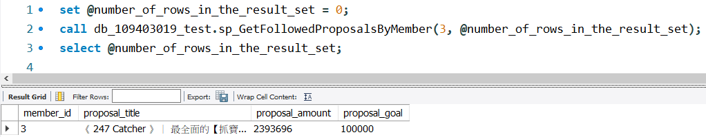

# 110-2 DBM Final Project Crowdfunding Platform

This is for NCU 110-2 Database Management Final Project - Crowdfunding Platform.

Using MySQL Workbench (8.0.29) and MySQL Server (8.0.29).

Thanks for Teachers and TAs in this course.

## My Info

---

- 姓名: 鄒翔宇
- 學號: 109403019
- 系級: 資管二 A

## Stored Procedure

---

**主要部分:**

- 輸入 **Input**
- 輸出 **Output**
- 所使用到的 **Tables**。 有用 `()` 包起來代表會使用到但不需要印出的屬性。
- 實作步驟 **Implementation**
- 執行結果 **DEMO**

### 1. sp_GetFollowedProposalsByMember

- **Input:** in_member_id(int)

- **Output:** number of rows in the result set (int)

- **Tables:**

  - followingrecord: member_id, (proposal_id)
  - proposal: title, amount, goal, (id)

- **Imeplmentation:**

  1. `SELECT` followingrecord table 與 proposal `JOIN` 後的資料，使用 member_id
     作為 `ON` 的匹配條件，member_id 為 'WHERE` 之條件。
  2. 將 `FOUND_ROWS()` 數值丟進要輸出的 outNumFound。

- **Demo:**
  

### 2. sp_RegisterMember

- **Input:** in_member_id (int), in_hashedPwd (varchar(200)), in_salt
  (char(64)), name (varchar(64)), address (varchar(255)), phone (varchar(64))

- **Output:** affected_row_num (int)

- **Tables:**

  - member: member_id, name, email, salt, phone, address
  - membercredential: hashed_pwd_string

- **Imeplmentation:**

  1. 將 member table 的 member_id 設為 Auto Increment。
  2. `DECLARE` temp 作為更動到的列數之變數，預設為 0。
  3. 使用 `EXISTS` 語法檢查 in_email 是否已存在於 member table 中，因為 email 必
     須唯一。若以存在則 `SELECT 0 INTO affected_row_num;`。
  4. 若尚未存在，則使用 `INSERT INTO ... VALUES` 將資料放入 member table 中。並
     搭配 `SELECT ROW_COUNT() INTO temp` 更新更動到的列數。
  5. 使用 `INSERT INTO ... SELECT` 語法將 `(member_id, member_id, in_hashedPwd)`
     此筆資料加入至 member credential table 中。並搭
     配　`SELECT ROW_COUNT() + temp INTO temp` 更新更動到的列數。
  6. 最後 `SELECT` member table 與 membercredential table `JOIN` 後的資料，使用
     member_id 作為 `ON` 的匹配條件，email 為 `WHERE` 之條件。
  7. 將 temp 數值丟進要輸出的 out_affected_row_num。

- **Demo:**
  

### 3. sp_UpdatePwd

- **Input:** in_member_id (int), in_hashedPwd (varchar(200)), in_salt (char(64))

- **Output:** affected_row_num (int)

- **Tables:**

  - member: member_id, name, email, salt, phone, address
  - membercredential: hashed_pwd_string

- **Imeplmentation:**

  1. 使用 `IF NOT EIXSTS` 檢查輸入 member_id 之 salt 與 hashed_pwd_string 是否與
     輸入的值皆不同。這部分要將 member table 與 membercredential table 作
     `JOIN`。
  2. `DECLARE` temp 作為更動到的列數之變數，預設為 0。
  3. 若確認 salt 與 hashed_pwd_string 皆一定會被更新，使用 `UPDATE ... SET` 語法
     更新 member table 中的 salt 以及 membercredential table 中的
     hashed_pwd_string。並搭配 `ROW_COUNT()` 更新 temp (更動到的列數)。
  4. 使用 `ROW_COUNT` 搭配 `IF` 條件式檢查是否有更新到資料，若大於 0 代表有更新
     到資料。
  5. 確認有更新到資料的話，用 `SELECT` 將 result 印出來。
  6. 將 temp 數值丟進要輸出的 out_affected_row_num。

- **Demo:**
  

### 4. sp_Login

- **Input:** in_email (varchar(64)), in_hashedpwd (varchar(200))

- **Output:** affected_row_num (int)

- **Tables:**

  - member: (email, member_id)
  - membercredential: (hashed_pwd_string)

- **Imeplmentation:**

  1. `DECLARE` 一個用來輸出的 status_code (int)，預設值設為 0。
  2. 使用 `IF EXISTS` 檢查 in_email 是否存在，若不存在 `SET` status_code 為 3。
     若存在執行以下。
  3. 檢查使用者登入的 email 是否為已刪除帳號，若是，`SET` status_code 為 3。若不
     是則執行以下，
  4. 如果使用者登入的 email 以及 hashed_pwd 正確則 `SET` status_code 為 1。
  5. 如果使用者登入的 email 正確但 hashed_pwd 錯誤則 `SET` status_code 為 2。
  6. 其餘狀況皆 `SET` status_code 為 3。

- **Demo:**

  

### 5. sp_GetProposalsByKeyword

- **Input:** in_keyword (varchar(64))

- **Output:** number of rows in the result set (int)

- **Tables:**

  - proposal: id, title, due_date, amount

- **Implementation:**

  1. 使用 `LIKE` 作關鍵字搜尋 (預設不分大小寫)，後方 pattern 使用 `CONCAT` 串接
     `('%', in_keyword, '%')`。

- **Demo:**
  

### 6. sp_UpdateProposalStatus

- **Input:** proposal_id (int), status (int)

- **Output:** affected_row_num (int)

- **Tables:**

  - proposal: id, status

- **Implementation:**

  1. `DECLARE` 一個用來輸出的 status_code (int)，預設值設為 0。
  2. 檢查 in_status 是不是在合理範圍內 (1~3)，若在合理範圍內則執行以下步驟。
  3. 使用 `UPDATE ... SET` 更新 proposal 內的資料，以 in_proposal_id 作為
     `WHERE` 的匹配條件，並且原 status 必須比 in_status 少 1 (更新順序只能遵循 1
     → 2 → 3)
  4. 延續上個步驟，將 status 更新為 in_status，並利用
     `IF(condition, true_value, false_value)` 有條件的更新 due_date，只有在
     in_status = 2 時，必須將 create_date + 90 天 設為 due_date。這邊利用
     `DATE_ADD(date, INTERVAL value addunit)` 回傳相加過後的日期。並搭配
     `ROW_COUNT()` 更新 temp (更動到的列數)。
  5. 使用 `IF ROWCOUNT() > 0` 判別是否該指定資料列被更新，若有則用 `SELECT` 將我
     們要的資料列印出來。
  6. 將 temp 數值丟進要輸出的 out_affected_row_num。

- **Demo:**
  

### 7. sp_GetHistorySponsorByMember

- **Input:** proposal_id (int), status (int)

- **Output:** number of rows in the result set (int)

- **Tables:**

  - sponsorrecord: member_id, amount, (proposal_option_id)
  - proposaloption: proposal_option_title, (proposal_id)
  - proposal: title, status

- **Implementation:**

  1. 將 sponserrecord table 以 proposal_option_id 作為 `ON` 之匹配條件與
     proposaloption table 作 `JOIN`。
  2. 再將 proposal table 以 proposal_id 作為 `ON` 之匹配條件與前者 table 作
     `JOIN`。
  3. 使用 `SELECT` 將 in_member_id 之歷史贊助紀錄列印出來。
  4. 將 `FOUND_ROWS()` 數值丟進要輸出的 outNumFound。

- **Demo:**
  

### 8. sp_sp_GetUnrepliedComments

- **input:** proposal_id (int), status (int)

- **Output:** number of rows in the result set (int)

- **tables:**

  - comment: member_id, proposal_id, id, user_comment, comment_time,
    proposor_response
  - proposal: title

- **Implementation:**

  1. 將 comment table 以 proposal_id 作為 `ON` 之匹配條件與 proposal table 作
     `JOIN`。
  2. `SELECT` 我們所需要的資料，`WHERE` 之條件為表中 member_id = in_member_id 並
     且 proposer_response 為空字串 `''` 或 `IS NULL`。
  3. 將 `FOUND_ROWS()` 數值丟進要輸出的 outNumFound。

- **Demo:**
  

### 9. sp_GetProposalByCompletionRate

- **input:** in_ratio (float)

- **Output:** number of rows in the result set (int)

- **tables:**

  - proposal: id, title, amount, goal

- **Implementation:**

  1. 從 proposal table 中 `SELECT` 要列印出的資料，ratio 以 amount / goal 作計算
     。`WHERE` 之條件為 amount / goal 大於等於 in_ratio。
  2. 使用 `ORDER BY amount /goal DESC` 作降冪排序列印資料。
  3. 將 `FOUND_ROWS()` 數值丟進要輸出的 outNumFound。

- **Demo:**
  

### 10. sp_CreateProposal

- **input:** member_id (int), title (varchar(120)), content (TEXT), goal (int),
  category_id (int)

- **Output:** affected_row_num (int)

- **tables:**

  - proposal: id, title, content, amount, goal, status, viewed_num, create_date,
    due_date, (category_id)
  - proposalmember
  - category: category_name

- **Implementation:**

  1. 將 proposal table 以及 proposalmember table 的 id 設為 Auto Increment。
  2. 判斷 in_member_id 是否存在於 member table 中，以及 in_category_id 是否存在
     於 category table 中，若存在則執行以下步驟。
  3. 使用 `INSERT INTO ... VALUES` 插入新的 proposal
     `(category_id, title, content, amount, goal, status, viewed_num, create_date, due_date, is_deactivated)`
     到 proposal table 中。其中 amount = 0, status = 1, viewed_num = 0, due_date
     = NULL, is_deactivated = 0。並搭配 `ROW_COUNT()` 更新 temp (更動到的列數)。
  4. 使用 `INSERT INTO ... VALUES` 插入新的關係資料
     `((SELECT id FROM proposal), in_member_id)` 至 proposalmember table 中。並
     搭配 `ROW_COUNT()` 更新 temp (更動到的列數)。
  5. 將 proposal table 以 category_id 作為 `ON` 之匹配條件與 category table 作
     `JOIN`。並從中 `SELECT` 我們需要的資料列印出來。
  6. 將 temp 數值丟進要輸出的 out_affected_row_num。

- **Demo:**
  

### 11. sp_GetRecommendedProposals

- **Purpose:** 輸入 member id 即可獲取推薦的 proposal。為點擊率最高的前五名。若
  為不符合推薦內容篩選標準則單純按照點擊率列出。

- **Input**: member_id (int)

- **Output:** number of rows in the result set (int)

- **Recommended conditions:**

  1. 和 member_id 贊助相同提案的人也贊助過的提案 (看 sponsorrecord table JOIN
     proposaloption table)
  2. 為 member_id 不曾贊助過的提案 (看 sponsorrecord table JOIN proposaloption
     table)
  3. 提案狀態必須是 2 (status = 2) (看 proposal table)
  4. 推薦內容不可以是自己的提案 (看 proposalmember table)

- **Tables:**

  - sponsorrecord: (proposal_option_id)
  - proposaloption: (proposal_id)
  - proposal: id, title, status, view_num
  - proposalmember: (member_id, proposal_id)

- **Idea:**

  1. 因為推薦內容功能經常被使用到，因此選擇創建一個 local temp table，只有中斷連
     線才會自動刪除此表格。
  2. 若 in_member_id 存在且贊助過提案，先透過 sponsorrecord table 與
     proposaloption table 找到 in_member_id 贊助過的提案，會得到一至多個
     proposal_id (不要重複) 並保存。
  3. 透過 sponsorrecord table 與 proposaloption table 搭配 proposal_id 查找有哪
     些人也贊助過會得到一至多個 member_id (不要重複)。
  4. 透過 proposal table 搭配先前保存 in_member_id 贊助過專案的 proposal_id，查
     找哪些專案沒贊助過。
  5. 將所有符合條件 1 與 條件 2 之提案作進一步篩選。提案狀態 status 須為 2，並透
     過 proposalmember 篩選 in_member_id 不為提案人的資料。

- **Implementation:**
  1. 先使用 `IF NOT EXISTS` 檢查 in_member_id 是否存在於 member table 中，若存在
     則執行以下步驟。
  2. 如果會員沒有贊助過任何提案，便不會出現在 sponsorrecord table 中。使用
     `IF NOT EXISTS` 檢查 in_member_id 是否存在於 sponsorrecord table 中，若不存
     在則從 proposal table 中 `SELECT` 我們要的資料，使用
     `ORDER BY viewed_num DESC`以點閱率作降冪排序並加上 `LIMIT 5`限制五個；若
     in_member_id 存在於 sponsorrecord table 中則執行以下步驟。
  3. 將 sponsorrecord table 以 proposal_option_id 作為 `ON` 之匹配條件與
     proposaloption table 作 `JOIN`。
  4. 將前者再與 proposal table 以 proposal_id 作為 `ON` 之匹配條件與
     proposalmember 作 `JOIN`。

### 12. sp_DeleteMember

- **Purpose:** 輸入 member_id 以終止其會員服務。

- **Idea:**

  1. 於 member table 中將該名會員資料作去識別化。
  2. (a) 將 name 設為 `USER_DELETED`  
     (b) email 設為 `deletedUser\_\_@@\_member_id`  
     (c) 留下 phone 以方便後續糾紛追蹤使用者(電話號碼相對電子郵件難做到免洗)  
     (d) 清空 salt  
     (e) address 設為刪除時的時間。
  3. 更新 membercredential table，將會員之 hashed_pwd_string 清空。
  4. 使被去識別化的會員無法作登入，需於 sp_Login 加入檢查。

- **Input**: member_id (int)

- **Output:** affected_row_num (int)

- **Tables:**

  - member
  - membercredential

- **Implementation:**

  1. `DECLARE` temp 用以儲存變動的列數。
  2. 使用 `IF EXISTS` 檢查 in_member_id 是否存在於 member table 中。若存在則執行
     以下步驟。
  3. 使用 `UPDATE ... SET` 去更新該使用者的資料。並搭配 `ROW_COUNT()` 更新 temp
     (更動到的列數)。
  4. 如果更動到的列數大於 0，代表成功使該會員停權，將其於 membercredential table
     中的 hashed_pwd_string 清空。
  5. 把刪除的 user 資料列印出來。

- **Demo:**
  

## 使用資料

- **修正版
   [期末專案情境說明 & Business Logics](https://docs.google.com/presentation/d/1cmGLFweg8OAyVqb5w_D7gHF3TvREq9lrjwk3kN_Mxzc/edit?usp=sharing)**
- **修正版
  [期末專案 Stored Procedures 規格書](https://docs.google.com/document/d/1zoVo4drKsUF5WJCEXVXt7WTGT5KEJ2EseINT3PSm1ac/edit?usp=sharing)**
- **[期末專案 Stored Procedures 問題整理](https://docs.google.com/document/d/1zxNZhbF2Bgx6n_-O6nKaNsYm3iSUZKAMpao9TSdQax0/edit?usp=sharing)**
