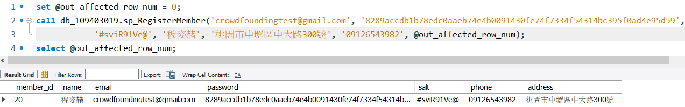
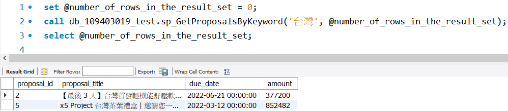
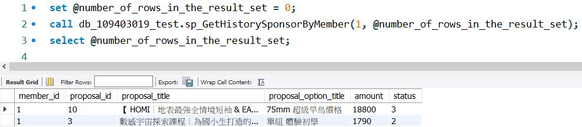
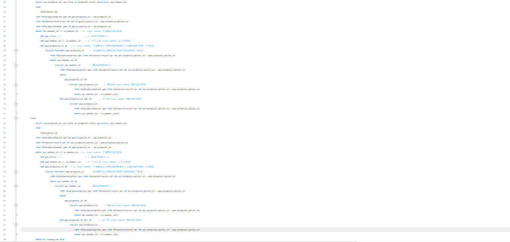

# 110-2 DBM Final Project Crowdfunding Platform

This is for NCU 110-2 Database Management Final Project - Crowdfunding Platform.

Using MySQL Workbench (8.0.29) and MySQL Server (8.0.29).

Thanks for Teachers and TAs in this course.

### My Info

- 姓名: 鄒翔宇
- 學號: 109403019
- 系級: 資管二 A

### Stored Procedure

**主要部分:**

- 目的 **Purpose**
- 輸入 **Input**
- 輸出 **Output**
- 所使用到的 **Tables**
- 實作步驟 **Implementation**
- 執行結果 **DEMO**

### 1. sp_GetFollowedProposalsByMember [DONE]

- **Purpose:** 透過會員 ID (member_id) 取得該會員追蹤的提案。

- **Input:** in_member_id(int)

- **Output:** number_of_rows_in_the_result_set (int)

- **Tables:** tblfollowingRecord, tblproposal

- **Imeplmentation:**

  1. `SELECT` tblfollowingrecord 與 tblproposal `JOIN` 後的資料，使用 member_id
     作為 `ON` 的匹配條件，member_id 為 `WHERE` 之條件。
  2. 將 `FOUND_ROWS()` 數值丟進要輸出的 number_of_rows_in_the_result_set (result
     set 的列數)。

- **Demo:**

  

### 2. sp_RegisterMember [DONE]

- **Purpose:** 註冊使用者，並於成功註冊後列出新增會員的所有欄位。

- **Input:** in_member_id (int), in_hashedPwd (varchar(200)), in_salt
  (char(64)), name (varchar(64)), address (varchar(255)), phone (varchar(64))

- **Output:** affected_row_num (int)

- **Tables:** tblmember, tblmembercredential

- **Imeplmentation:**

  1. 需將 member table 的 member_id 設為 Auto Increment。
  2. `DECLARE` temp 作為更動到的列數之變數，預設為 0。
  3. 使用 `EXISTS` 語法檢查 in_email 是否已存在於 tblmember 中，因為 email 必須
     唯一，因此不可以用重複的 email 註冊。若已經存在則不執行以下動作。
  4. 若尚未存在，則使用 `INSERT INTO ... VALUES` 將資料放入 tblmember 中。並搭配
     `SELECT ROW_COUNT() INTO temp` 更新更動到的列數。
  5. 使用 `INSERT INTO ... SELECT` 語法將新建使用者 credential 的資料此筆資料加
     入至 tblmembercredential 中。並搭配　`SELECT ROW_COUNT() + temp INTO temp`
     更新更動到的列數。
  6. 將指定的表格呈現出來，使用 `SELECT` tblmember 與 tblmembercredential `JOIN`
     後的資料，使用 member_id 作為 `ON` 的匹配條件，email = in_email 為 `WHERE`
     之條件。
  7. 最後將 temp 數值丟進要輸出的 affected_row_num。

- **Demo:**

  

### 3. sp_UpdatePwd [DONE]

- **Purpose:** 更新會員密碼，必須確認密碼以及 salt 都有更新。

- **Input:** in_member_id (int), in_hashedPwd (varchar(200)), in_salt (char(64))

- **Output:** affected_row_num (int)

- **Tables:** tblmember, tblmembercredential

- **Imeplmentation:**

  1. `DECLARE` temp 作為更動到的列數之變數，預設為 0。
  2. 使用 `IF NOT EIXSTS` 檢查輸入 member_id 之 salt 與 hashed_pwd_string 是否與
     輸入的值皆不同 (因為規定兩者皆需要更新)。這部分要將 tblmember 與
     tblmembercredential 以 member_id 作 `JOIN`。
  3. 若確認 salt 與 hashed_pwd_string 皆一定會被更新，使用 `UPDATE ... SET` 語法
     更新 tblmember 中的 salt 以及 tblmembercredential 中的 hashed_pwd_string。
     並搭配 `ROW_COUNT()` 更新 temp (更動到的列數)。
  4. 使用 `ROW_COUNT` 搭配 `IF` 條件式檢查是否有更新到資料，若大於 0 代表有更新
     到資料。
  5. 確認有更新到資料的話，用 `SELECT` 將該用戶更新後的 result 印出來。
  6. 將 temp 數值丟進要輸出的 affected_row_num。

- **Demo:**

  

### 4. sp_Login [DONE]

- **Purpose:** 透過 email 以及加密過後的密碼作登入。status_code: 1 -> 登入成功,
  2 -> 密碼錯誤, 3 -> 登入失敗 (會員不存在)

- **Input:** in_email (varchar(64)), in_hashedpwd (varchar(200))

- **Output:** status_code (int)

- **Tables:** tblmember, tblmembercredential

- **Imeplmentation:**

  1. 使用 `IF EXISTS` 檢查 in_email 是否存在，若不存在 `SET` status_code 為 3。
     若存在執行以下。
  2. 檢查使用者登入的 email 是否為已刪除帳號，若是，`SET` status_code 為 3。若不
     是則執行以下。
  3. 如果使用者登入的 email 以及 hashed_pwd 正確則 `SET` status_code 為 1。
  4. 如果使用者登入的 email 正確但 hashed_pwd 錯誤則 `SET` status_code 為 2。
  5. 其餘狀況皆 `SET` status_code 為 3。

- **Demo:**

  

### 5. sp_GetProposalsByKeyword [DONE]

- **Purpose:** 透過關鍵字進行對提案標題 (proposal_title) 的模糊搜尋。

- **Input:** in_keyword (varchar(64))

- **Output:** number_of_rows_in_the_result_set (int)

- **Tables:** tblproposal

- **Implementation:**

  1. 使用 `SELECT` 搭配 `LIKE` 作關鍵字搜尋 (預設不分大小寫)，後方 pattern 使用
     `CONCAT` 串接 `('%', in_keyword, '%')`。

- **Demo:**

  

### 6. sp_UpdateProposalStatus [DONE]

- **Purpose:** 更改提案狀態。有三種狀態，需注意更新順序需遵循 1 -> 2 -> 3。若
  status 為 2 且達標率大於 90% 可以延長截止日期 30 天。

- **Input:** proposal_id (int), status (int)

- **Output:** affected_row_num (int)

- **Tables:** tblproposal

- **Implementation:**

  1. `DECLARE` temp 作為更動到的列數之變數，預設為 0。
  2. 檢查 in_status 是不是在合理範圍內 (1~3)，若在合理範圍內則執行以下步驟。
  3. 使用 `UPDATE ... SET` 更新 tblproposal 內的資料，以 proposal_id =
     in_proposal_id 作為 `WHERE` 的匹配條件，並且原 status 必須比 in_status 少 1
     (更新順序只能遵循 1 → 2 → 3)。
  4. 延續上個步驟，將 status 更新為 in_status。
  5. 並利用 `IF(condition, true_value, false_value)` 有條件的更新 due_date，只有
     在 in_status = 2 時，必須將當下時間 + 90 天 設為 due_date。這邊利用
     `DATE_ADD(NOW(), INTERVAL value addunit)` 回傳相加過後的日期。
  6. 檢查達標率 (amount/goal) 是否大於 0.9，若大於一樣使用 `DATE_ADD()` 將截止時
     間加長 30 天。
  7. 搭配 `ROW_COUNT()` 更新 temp (更動到的列數)。
  8. 使用 `IF ROWCOUNT() > 0` 檢查該指定資料列是否有被更新，若有則用 `SELECT` 將
     我們要的資料列印出來。
  9. 將 temp 數值丟進要輸出的 affected_row_num。

- **Demo:**

  

### 7. sp_GetHistorySponsorByMember [DONE]

- **Purpose:** 透過會員 ID (member_id) 查詢該會員過去贊助過的提案。

- **Input:** proposal_id (int), status (int)

- **Output:** number_of_rows_in_the_result_set (int)

- **Tables:** tblsponsorrecord, tblproposaloption, tblproposal

- **Implementation:**

  1. 將 tblsponsorrecord 以 proposal_option_id 作為 `ON` 之匹配條件與
     proposaloption table 作 `JOIN`。
  2. 再將 tblproposal 以 proposal_id 作為 `ON` 之匹配條件與前者作 `JOIN`。
  3. 使用 `SELECT` 將 in_member_id 之歷史贊助紀錄列印出來。
  4. 將 `FOUND_ROWS()` 數值丟進要輸出的 number_of_rows_in_the_result_set。

- **Demo:**

  

### 8. sp_sp_GetUnrepliedComments [DONE]

- **Purpose:** 透過會員 ID (member_id) 搜尋該會員擁有的所有提案中尚未回覆的留言
  。
- **Input:** proposal_id (int), status (int)

- **Output:** number_of_rows_in_the_result_set (int)

- **tables:** tblcomment, tblproposal

- **Implementation:**

  1. 將 tblcomment 以 proposal_id 作為 `ON` 之匹配條件與 tblproposal 作 `JOIN`。
  2. `SELECT` 我們所需要的資料，`WHERE` 之條件為表中 member_id = in_member_id 並
     且 proposer_response 為空字串 `''` 或 `IS NULL`。
  3. 將 `FOUND_ROWS()` 數值丟進要輸出的 number_of_rows_in_the_result_set。

- **Demo:**

  

### 9. sp_GetProposalByCompletionRate [DONE]

- **Purpose:** 透過輸入 ratio (amount/goal) 列出所有高於達標比例的提案，並由高至
  低排序。

- **Input:** in_ratio (float)

- **Output:** number_of_rows_in_the_result_set (int)

- **tables:** tblproposal

- **Implementation:**

  1. 從 tblproposal 中 `SELECT` 要列印出的資料，ratio 以 `amount / goal` 作計算
     。`WHERE` 之條件為 amount / goal 大於等於 in_ratio。
  2. 使用 `ORDER BY amount /goal DESC` 作降冪排序列印資料。
  3. 將 `FOUND_ROWS()` 數值丟進要輸出的 number_of_rows_in_the_result_set。

- **Demo:**
  

### 10. sp_CreateProposal [DONE]

- **Purpose:** 創建新的提案 (proposal)。

- **Input:** member_id (int), title (varchar(120)), content (TEXT), goal (int),
  category_id (int)

- **Output:** affected_row_num (int)

- **tables:** tblproposal, tblproposalmember, tblcategory

- **Implementation:**

  1. 需將 tblproposal 以及 tblproposalmember table 的 id 設為 Auto Increment。
  2. `DECLARE` temp 作為更動到的列數之變數，預設為 0。
  3. 判斷 in_member_id 是否存在於 tblmember 中，以及 in_category_id 是否存在於
     tblcategory 中，若存在則執行以下步驟。
  4. 使用 `INSERT INTO ... VALUES` 插入新的 proposal 到 tblproposal 中。並搭配
     `ROW_COUNT()` 更新 temp (更動到的列數)。
  5. 使用 `INSERT INTO ... VALUES` 插入新的關係資料至 tblproposalmember 中。並搭
     配 `ROW_COUNT()` 更新 temp (更動到的列數)。
  6. 將 tblproposal 以 category_id 作為 `ON` 之匹配條件與 tblcategory 作
     `JOIN`。並從中 `SELECT` 我們需要的資料列印出來。
  7. 將 temp 數值丟進要輸出的 affected_row_num。

- **Demo:**
  

### 11. sp_GetRecommendedProposals [DONE]

- **Purpose:** 輸入會員 ID (member_id) 獲取推薦的提案 (proposal)。列出點擊率
  (viewed_num) 最高的前五名。若不符合推薦內容篩選標準則單純按照點擊率列出。

- **Input**: member_id (int)

- **Output:** number of rows in the result set (int)

- **Recommended conditions:**

  1. 和 in_member_id 贊助相同提案的人也贊助過的提案 (最複雜的)
  2. 為 in_member_id 不曾贊助過的提案
     。`tblsponsorrecord.member_id != in_member_id`
  3. 提案狀態必須是 2。`status = 2`
  4. 推薦內容不可以是自己的提案 `tblproposalmember.member_id != in_member_id`

- **Tables:** tblsponsorrecord, tblproposaloption, tblproposal,
  tblproposalmember

- **Idea:**

  1. tblsponsorrecord `JOIN` tblproposaloption 可以找出所有贊助者以及贊助之選項
     。
  2. 再 `JOIN` tblproposal 可以找出贊助之選項的提案 ID。
  3. proposalmember 可以用找出提案者。
  4. 因此全部 `JOIN` 在一起，再用 `WHERE` 將條件一一解決。

- **Implementation:**

  1. 先使用 `IF NOT EXISTS` 檢查 in_member_id 是否存在於 tblmember 中。若不存在
     則直接列出點擊率最高的五個提案。若存在則執行以下步驟。
  2. 判斷是否符合四個條件，若符合則將其列印出來。若不符合則列出點擊率最高的五個
     提案。
  3. 將 tblsponsorrecord, tblproposaloption, tblpropsoal `JOIN` 在一起，透過
     `WHERE` 設立條件式。
  4. 該會員不曾贊助過的提案，`tblsponsorrecord.member_id != in_member_id`。
  5. 提案狀態為 2，`tblproposal.status = 2`。
  6. 不可以是該會員自己的提案，`tblproposalmember.member_id != in_member_id`。
  7. 找到與該會員贊助的提案也贊助過的提案，因為不要重複因此使用
     `SELECT DISTINCT`。
  8. 先找到該會員贊助過的提案，接著查找贊助相同提案的人。
  9. 查找他們贊助的提案。設立條件式為他們贊助過的提案且不是該會員贊助的提案。
  10. 使用 `ORDER BY viewed_num DESC` 達到以點閱率作降冪排序。
  11. 使用 `LIMIT` 限制最多列出五個。
  12. 將 `FOUND_ROWS()` 數值丟進要輸出的 number_of_rows_in_the_result_set。

- **Demo:**

  

- **Report:**

  這題應該算是魔王題，花了幾個小時的時間思考以及除錯，各種表的交叉以及條件設定，
  本來還在想要用 temp table 來存放 sponsorrecord 與 proposaloption 合併後的紀錄
  ，不過 temp table 一次呼叫只能 select 一次，因此後來就是全部都 JOIN 在一起去處
  理。這邊放兩張照片來壓壓驚

  - 多多多多多層選取

    

  - 醜陋的巨無霸條件式

    

### 12. sp_DeleteMember [DONE]

- **Purpose:** 輸入 member_id 以終止其會員服務。

- **Idea:**

  1. 於 member table 中將該名會員資料作*去識別化*。
  2. (a) 將 name 設為 `USER_DELETED`  
     (b) email 設為 `deletedUser\_\_@@\_member_id`  
     (c) 留下 phone 以方便後續糾紛追蹤使用者(電話號碼相對電子郵件難做到免洗)  
     (d) 清空 salt  
     (e) address 設為刪除時的時間。
  3. 更新 membercredential table，將會員之 hashed_pwd_string 清空。
  4. 使被去識別化的會員無法作登入，需於 sp_Login 加入檢查。

- **Input**: member_id (int)

- **Output:** affected_row_num (int)

- **Tables:** tblmember, tblmembercredential

- **Implementation:**

  1. `DECLARE` temp 用以儲存變動的列數，預設為 0。
  2. 使用 `IF EXISTS` 檢查 in_member_id 是否存在於 tblmember 中。若存在則執行以
     下步驟。
  3. 使用 `UPDATE ... SET` 去更新該使用者的資料。並搭配 `ROW_COUNT()` 更新 temp
     (更動到的列數)。
  4. 如果更動到的列數大於 0，代表成功使該會員停權，將其於 tblmembercredential 中
     的 hashed_pwd_string 清空。
  5. 把刪除的 user 資料列印出來。

- **Demo:**

  

## 使用資料

- **修正版
   [期末專案情境說明 & Business Logics](https://docs.google.com/presentation/d/1cmGLFweg8OAyVqb5w_D7gHF3TvREq9lrjwk3kN_Mxzc/edit?usp=sharing)**
- **修正版
  [期末專案 Stored Procedures 規格書](https://docs.google.com/document/d/1zoVo4drKsUF5WJCEXVXt7WTGT5KEJ2EseINT3PSm1ac/edit?usp=sharing)**
- **[期末專案 Stored Procedures 問題整理](https://docs.google.com/document/d/1zxNZhbF2Bgx6n_-O6nKaNsYm3iSUZKAMpao9TSdQax0/edit?usp=sharing)**
