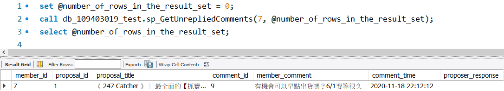

# 110-2 DBM Final Project Crowdfunding Platform

This is for NCU 110-2 Database Management Final Project - Crowdfunding Platform.

Using MySQL Workbench (8.0.29) and MySQL Server (8.0.29).

Thanks for Teachers and TAs in this course.

## My Info

- 姓名: 鄒翔宇
- 學號: 109403019
- 系級: 資管二 A

## Stored Procedure

**主要有三部分:**

- 輸入 **Input**
- 所使用到的 **Tables**。 有用 `()` 包起來代表會使用到但不需要印出的屬性。
- 實作步驟 **Implementation**

### 1. sp_GetFollowedProposalsByMember

- **Input:** in_member_id(int)

- **Tables:**

  - followingrecord: member_id, (proposal_id)
  - proposal: title, amount, goal, (id)

- **Imeplmentation:**

  1. `SELECT` followingrecord table 與 proposal `JOIN` 後的資料，使用 member_id
     作為 `ON` 的匹配條件，member_id 為 'WHERE` 之條件。
  2. 將 `FOUND_ROWS()` 數值丟進要輸出的 outNumFound。

- **Demo:**
  

### 2. sp_RegisterMember

- **Input:** in_member_id (int), in_hashedPwd (varchar(200)), in_salt
  (char(64)), name (varchar(64)), address (varchar(255)), phone (varchar(64))

- **Tables:**

  - member: member_id, name, email, salt, phone, address
  - membercredential: hashed_pwd_string

- **Imeplmentation:**

  1. 將 member table 的 member_id 設為 Auto Increment。
  2. 使用 `EXISTS` 語法檢查 in_email 是否已存在於 member table 中，因為 email 必
     須唯一。若以存在則 `SELECT 0 INTO affected_row_num;`。
  3. 若尚未存在，則使用 `INSERT INTO ... VALUES` 將資料放入 member table 中。
  4. 使用 `INSERT INTO ... SELECT` 語法將 `(member_id, member_id, in_hashedPwd)`
     此筆資料加入至 member credential table 中。
  5. 最後 `SELECT` member table 與 membercredential table `JOIN` 後的資料，使用
     member_id 作為 `ON` 的匹配條件，email 為 `WHERE` 之條件。
  6. 將 `FOUND_ROWS()` 數值丟進要輸出的 out_affected_row_num。

- **Demo:**
  

### 3. sp_UpdatePwd

- **Input:** in_member_id (int), in_hashedPwd (varchar(200)), in_salt (char(64))

- **Tables:**

  - member: member_id, name, email, salt, phone, address
  - membercredential: hashed_pwd_string

- **Imeplmentation:**

  1. 使用 `IF NOT EIXSTS` 檢查輸入 member_id 之 salt 與 hashed_pwd_string 是否與
     輸入的值皆不同。這部分要將 member table 與 membercredential table 作
     `JOIN`。
  2. 若確認 salt 與 hashed_pwd_string 皆一定會被更新，使用 `UPDATE ... SET` 語法
     更新 member table 中的 salt 以及 membercredential table 中的
     hashed_pwd_string。
  3. 使用 `ROW_COUNT` 取得幾個列有被更新並設 `IF` 條件式，若大於 0 代表有更新到
     資料。
  4. 確認有更新到資料後，用 `SELECT` 將被更新的列印出來。
  5. 將 `FOUND_ROWS()` 數值丟進要輸出的 out_affected_row_num。

- **Demo:**
  

### 4. sp_Login

- **Input:** in_email (varchar(64)), in_hashedpwd (varchar(200))

- **Tables:**

  - member: (email, member_id)
  - membercredential: (hashed_pwd_string)

- **Imeplmentation:**

  1. `DECLARE` 一個用來輸出的 status_code (int)，預設值設為 0。
  2. 使用 `IF EXISTS` 檢查 in_email 使否存在以及 in_hashedpwd 是否與該 member 的
     hashed_pwd_string 相同。
  3. 若條件成立，則 `SET` status_code 為 1，也就是登入成功。
  4. 若 in_email 存在可是 in_hashedpwd 不正確，則 `SET` status_code 為 2。
  5. 如果前兩者條件皆不成立， `SET` status_code 為 3。
  6. 將 `FOUND_ROWS()` 數值丟進要輸出的 outNumFound。

- **Demo:** 

### 5. sp_GetProposalsByKeyword

- **Input:** in_keyword (varchar(64))

- **Tables:**

  - proposal: id, title, due_date, amount

- **Implementation:**

  1. 使用 `LIKE` 作關鍵字搜尋 (預設不分大小寫)，後方 pattern 使用 `CONCAT` 串接
     `('%', in_keyword, '%')`。

- **Demo:**
  

### 6. sp_UpdateProposalStatus

- **Input:** proposal_id (int), status (int)

- **Tables:**

  - proposal: id, status

- **Implementation:**

  1. 先檢查 in_status 是不是在合理範圍內 (1~3)，若在合理範圍內則執行以下步驟。
  2. 使用 `UPDATE ... SET` 更新 proposal 內的資料，以 in_proposal_id 作為
     `WHERE` 的匹配條件，並且原 status 必須比 in_status 少 1 (更新順序只能遵循 1
     → 2 → 3)
  3. 延續上個步驟，將 status 更新為 in_status，並利用
     `IF(condition, true_value, false_value)` 有條件的更新 due_date，只有在
     in_status = 2 時，必須將 create_date + 90 天 設為 due_date。這邊利用
     `DATE_ADD(date, INTERVAL value addunit)` 回傳相加過後的日期。
  4. 使用 `IF ROWCOUNT() != 0` 判別是否該指定資料列被更新，若有則用 ` SELECT` 將
     我們要的資料列印出來。
  5. 將 `FOUND_ROWS()` 數值丟進要輸出的 out_affected_row_num。

- **Demo:**
  

### 7. sp_GetHistorySponsorByMember

- **Input:** proposal_id (int), status (int)

- **Tables:**

  - sponsorrecord: member_id, amount, (proposal_option_id)
  - proposaloption: proposal_option_title, (proposal_id)
  - proposal: title, status

- **Implementation:**

  1. 將 sponserrecord table 以 proposal_option_id 作為 `ON` 之匹配條件與
     proposaloption table 作 `JOIN`。
  2. 再將 proposal table 以 proposal_id 作為 `ON` 之匹配條件與前者 table 作
     `JOIN`。
  3. 使用 `SELECT` 將 in_member_id 之歷史贊助紀錄列印出來。
  4. 將 `FOUND_ROWS()` 數值丟進要輸出的 outNumFound。

- **Demo:**
  

### 8. sp_sp_GetUnrepliedComments

- **input:** proposal_id (int), status (int)

- **tables:**

  - comment: member_id, proposal_id, id, user_comment, comment_time,
    proposor_response
  - proposal: title

- **Implementation:**

  1. 將 comment table 以 proposal_id 作為 `ON` 之匹配條件與 proposal table 作
     `JOIN`。
  2. `SELECT` 我們所需要的資料，`WHERE` 之條件為表中 member_id = in_member_id 並
     且 proposer_response 為空字串 `''` 或 `IS NULL`。
  3. 將 `FOUND_ROWS()` 數值丟進要輸出的 outNumFound。

- **Demo:**
  

### 9. sp_GetProposalByCompletionRate

- **input:** in_ratio (float)

- **tables:**

  - proposal: id, title, amount, goal

- **Implementation:**

  1. 從 proposal table 中 `SELECT` 要列印出的資料，ratio 以 amount / goal 作計算
     。`WHERE` 之條件為 amount / goal 大於等於 in_ratio。
  2. 使用 `ORDER BY amount /goal DESC` 作降冪排序列印資料。
  3. 將 `FOUND_ROWS()` 數值丟進要輸出的 outNumFound。

- **Demo:**
  

### 10. sp_CreateProposal

- **input:** member_id (int), title (varchar(120)), content (TEXT), goal (int),
  category_id (int)

- **tables:**

  - proposal: id, title, content, amount, goal, status, viewed_num, create_date,
    due_date, (category_id)
  - proposalmember
  - category: category_name

- **Implementation:**

  1. 將 proposal table 以及 proposalmember table 的 id 設為 Auto Increment。
  2. 判斷 in_member_id 是否存在於 member table 中，以及 in_category_id 是否存在
     於 category table 中，若存在則執行以下步驟。
  3. 使用 `INSERT INTO ... VALUES` 插入新的 proposal
     `(category_id, title, content, amount, goal, status, viewed_num, create_date, due_date, is_deactivated)`
     到 proposal table 中。其中 amount = 0, status = 1, viewed_num = 0, due_date
     = NULL, is_deactivated = 0。
  4. 使用 `INSERT INTO ... VALUES` 插入新的關係資料
     `((SELECT id FROM proposal), in_member_id)` 至 proposalmember table 中。
  5. 將 proposal table 以 category_id 作為 `ON` 之匹配條件與 category table 作
     `JOIN`。並從中 `SELECT` 我們需要的資料列印出來。

- **Demo:**
  

### 11. sp_GetRecommendedProposals

- **input**: member_id (int)

- **recommended conditions:**

  - 和 member_id 贊助相同提案的人也贊助過的提案
  - 為 member_id 不曾贊助過的提案
  - 提案狀態必須是 2 (status = 2)
  - 推薦內容不可以是自己的提案

- **tables:**

  - sponsorrecord: ()
  - proposal: id, title, status, view_num

- **Implementation:**

### 12. sp_DeleteMember
